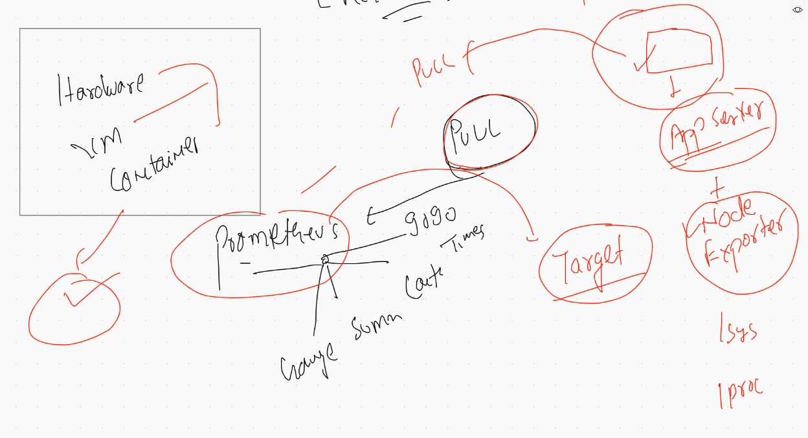
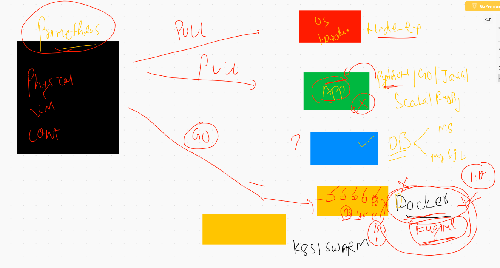

# what if Node Exporter is not giving relevent metrics 



## Prometheus client libraries 

### python link 

[python github] ('https://github.com/prometheus/client_python')

## install PYthon3 in your http app server 

```
yum install python3 -y

```

##  check and install prometheus client library

```
pip3 install prometheus_client 

```

## integratin docker engine to prometheus 

```
cat /etc/docker/daemon.json
{
  "metrics-addr" : "ip:9323",
  "experimental" : true

}
```

## reload docker deamon

```
systemctl daemon-reload
systemctl restart docker
```


## Now make changes in prometheus.yml and restart service of prometheus


## prometheus integrations


