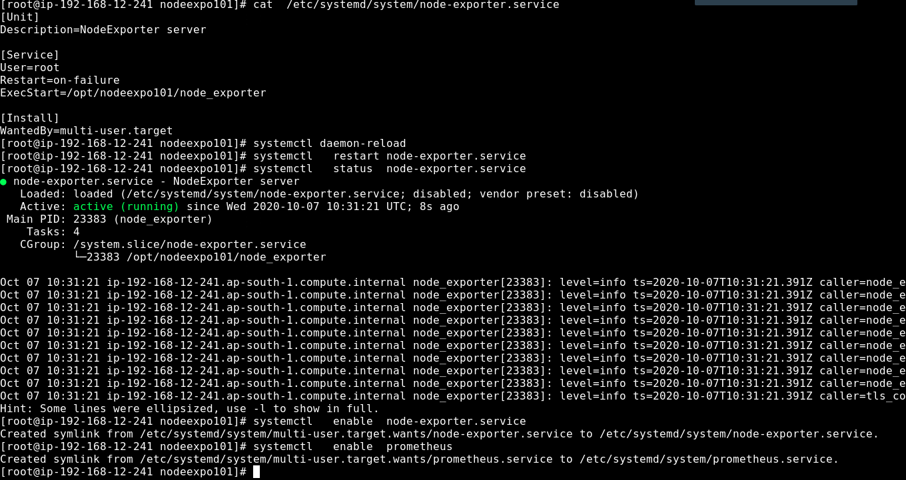

#  Prometheus 

## Installation 

```
cd /opt
wget https://github.com/prometheus/prometheus/releases/download/v2.21.0/prometheus-2.21.0.linux-amd64.tar.gz

```

## Extract file 

```
tar xvzf prometheus-2.21.0.linux-amd64.tar.gz
mv pro*  prom221

```

## create storage directory 

```
mkdir /var/lib/prometheus/data
```

## create systemd file for production grade servers

```
vim /etc/systemd/system/prometheus.service
------ data in file must be this 

[Unit]
Description=Prometheus server 
Documentation=https://prometheus.io/docs/introduction/overview/

[Service]
User=root
Restart=on-failure
ExecStart=/opt/prom221/prometheus  --config.file=/opt/prom221/prometheus.yml  --storage.tsdb.path=/var/lib/prometheus/data

[Install]
WantedBy=multi-user.target

```

## reload and restart 

```
systemctl daemon-reload
systemctl restart prometheus

```

# Node Exporter 


## starting and enable node exporter


